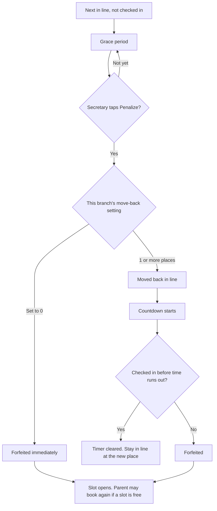
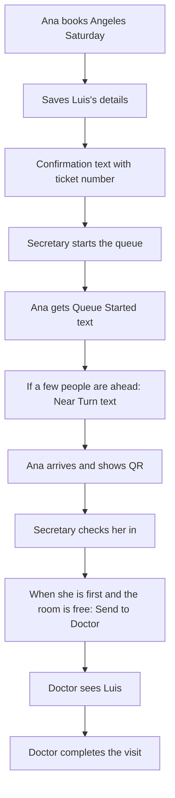

# How PlusQueue Works

A plain-language guide for clinic staff, a new secretary, or anyone who needs to understand the system without programming knowledge.

PlusQueue is the clinic’s digital line. Families reserve a slot from home, watch their place in line, and check in at the desk. Staff keep the line fair and send one patient at a time to the doctor.

---

## 1. What is PlusQueue?

Pediatric clinics often get crowded because families have to wait on-site without knowing when they will be seen. PlusQueue lets a parent reserve a slot, stay elsewhere until it is almost their turn, then arrive with a digital ticket.

Three people use it every clinic day:

- **Parents / guardians** book and follow the line on their phone.
- **Secretaries** run the front desk at one branch (including pause/resume/close/end if the doctor is busy).
- **Doctors** see patients and control the live session (pause, resume, close). Completing a consultation is doctor-only.

An **Admin** works in the background (staff accounts, branches, reports) and does not run the queue.

---

## 2. Who uses the system

### Parent / Guardian

Creates an account, verifies phone and email, and adds at least one child. Then they can:

- Reserve one clinic slot for a chosen date
- Choose which children are coming (several children still share **one** slot)
- Watch their ticket and place in line
- Show a QR code (or a 6-character code) at the desk
- Cancel **before** check-in
- Receive text messages about the visit

### Secretary

Assigned to **one branch** (for example Angeles). They:

- Create and publish that branch’s schedules
- Start the day’s queue
- Check people in (scan QR or type the code)
- Add **walk-in** patients (in person or phone-in)
- Penalize someone who is next but has not arrived (including walk-ins who were marked checked-in)
- Send the next checked-in patient to the doctor
- Pause, resume, close, or end the live clinic session if the doctor is busy
- Set this branch’s late rules and SMS wording

### Doctor

There is one active doctor account. They can:

- Create and publish schedules for **any** branch
- Start a queue
- Pause, resume, or close the live session (Secretary can do these four session actions too)
- Complete a consultation (with optional notes)

### Admin

Creates staff accounts, manages branches, and reviews reports. They do not check in patients or run the floor.

---

## 3. How reservations work

A **reservation** is a booked slot on a published clinic schedule. Booking gives the parent a **ticket number** (for example Queue #7). That number never changes, even if they are later moved back in line.

### How a parent books

1. Open **Reserve** and pick a published schedule that still has slots.
2. The system holds a slot and assigns a ticket number plus a QR / 6-character code.
3. The parent selects the children and the reason for the visit, then saves.
4. They receive a confirmation text (see [Notifications](#7-notifications-summary-sms)).

They can book while reservations are open, and also after the queue has already started — as long as slots remain and the queue has not been closed for the day.

### One booking per day (any branch)

A parent may hold **only one active reservation on the same calendar date**, even across branches.

**Example:** Maria cannot book Angeles on Saturday *and* Magalang on that same Saturday. She *can* book Angeles on Saturday and Magalang on Sunday.

“Active” means the visit is still in progress (reserved, checked in, or with the doctor). Cancelled or forfeited bookings no longer count, so she could book again that day if a slot is free.

### Other booking rules currently enforced

- The schedule must be **published**, and there must be an open slot.
- After the doctor **closes** the queue (or the session ends), new bookings are refused.
- If the parent **already finished a consultation with this doctor that day**, they cannot book another slot the same day. They are told to wait for the doctor’s next clinic schedule.
- Several children on one visit still use **one** slot and **one** ticket.
- A parent can cancel only **before** check-in. After the desk validates their QR, they cannot cancel.

### Walk-in patients (no parent account)

A walk-in is someone who did not book through the app. The secretary adds them from Profile → Walk-in Patient: pick a schedule, enter the children and concern. Parent’s name and phone are **optional**.

- **In person:** leave parent name/phone blank. The desk will call the child’s name when it is their turn.
- **Phone-in:** fill in parent name and phone so the system can text reservation details.

The system:

- Creates a normal queue ticket
- Marks them **already checked in** (no QR step)
- Puts them into the live line like anyone else

If a parent phone is provided **and the queue has not started yet**, they get **one** confirmation text with the same reservation details as a normal booking (branch, date, ticket number). They do **not** get Queue Started, Near Turn, or later clinic texts. If the queue is already running, no text is sent. In-person walk-ins (no phone) get no texts. They still count as one slot.

---

## 4. How the queue works

### What “starting the queue” means

Publishing a schedule only opens **booking**. Starting the queue opens the **clinic floor**.

Until the secretary or doctor starts the queue, the desk **cannot** validate QR codes. Parents with bookings get a “queue has started” text. People who are approaching (but not already first) also get a **Near Turn** text at that moment.

Only **one** clinic queue can run at a time. Staff must finish the current one before starting another.

### Ticket number vs place in line

| What the parent sees | What it means |
|---|---|
| **Ticket number** (Queue #7) | Assigned when they booked. Never changes. |
| **Place in line** | Who is actually next. This *can* change if someone ahead is cancelled or if a late parent is moved back. |

Order starts as first-come, first-served. Official penalties are the only staff action that rearranges the line.

### Near Turn notification

When the queue **first starts**, parents who have a small number of people ahead of them (default: 3; each branch can change this) get a text: it is almost their turn, please head to the clinic.

- The person who is **already first** does not get this text — they are already up.
- This text is sent **once at queue start**, not every time the line later shuffles.

### Penalty, move-back, and forfeiture

If the person who is **next** has not arrived, the secretary can **penalize** them. For a normal booking this means they have not checked in. For a **walk-in**, they are already marked checked-in when created, but Penalize still works if they are next and do not show up when called.

Each branch sets three numbers (Secretary → Settings):

- **Grace period** (default 2 minutes) — a short wait after someone becomes next, so they can walk in before Penalize is available.
- **Move-back** (default 2 places, range 0–10) — how far they are pushed behind others.
- **Timer** (default 15 minutes) — how long they then have to check in.

**The late-parent story**

1. Alex is next and has not arrived. After the grace period, the secretary taps **Penalize**.
2. If move-back is 1 or more: Alex is moved behind that many waiting people (or to the end if fewer people are behind). A **countdown** starts. The parent sees it on their phone (“check in within X or this reservation will be forfeited”) and gets a late text.
3. If Alex checks in **before** the timer ends, the countdown stops. They stay in line at the **new** place. They are not removed.
4. If the timer runs out with no check-in, the reservation is **forfeited** — the slot is given up. They get a forfeiture text and may book again if slots remain.
5. If the branch set move-back to **0**, there is no move and no timer: Penalize **forfeits immediately**.

There is no limit on how many times a parent can be moved back. Later penalties **do not reset** the first countdown — the original deadline stays.

### QR code validation (check-in)

Check-in proves the family is **physically at the clinic**. The secretary scans the parent’s QR or types the 6-character code.

- Queue must already be **started**.
- The parent must have finished entering patient information.
- After a successful scan, the ticket is **checked in**. Only then can they be sent to the doctor.
- Check-in also **clears** a late countdown, if one was running.
- Walk-ins skip this step — they are checked in when the secretary adds them.

The desk will refuse a code that is invalid, belongs to another branch, is already checked in, or belongs to a visit that already ended.

### Queue pausing

The **doctor or secretary** can pause the live session (for example a short break). Secretary session controls live on Manage Queue (Pause, Resume, Close Queue, End Clinic Session). Completing a consultation stays **doctor-only**.

- Parents see that the queue is paused.
- The doctor cannot complete a consultation until they resume.
- **Secretaries can still validate QR codes while paused.** Arriving parents are checked in and wait until the session resumes.

When the doctor or secretary **closes** the queue, new bookings stop. Patients already in line can still be processed.

### One patient with the doctor

Only **one** consultation at a time. The secretary can send someone in only if:

- they are **first** in the waiting line,
- they are **checked in**, and
- nobody is currently with the doctor.

When the doctor completes the visit, the room frees and the next checked-in patient can go in.

---

## 5. Sample workflow

**Saturday at the Angeles branch.** Ana reserved a slot for her son Luis.

1. Ana opens Reserve, picks Angeles Saturday, and gets ticket **#5**.
2. She selects Luis, enters the concern, and saves. She receives a confirmation text with date, time, ticket number, doctor, and branch.
3. Later, the secretary starts the queue. Ana gets a “queue has started” text. If she is close to the front (but not already first), she also gets Near Turn: please head to the clinic.
4. At the desk, the secretary scans Ana’s QR. Luis is marked present.
5. When #5 is first among waiting patients and the doctor is free, the secretary taps **Send to Doctor**.
6. The doctor sees Luis, may add notes, and taps **Complete Consultation**. The visit is recorded. Ana gets a completion notice in the app. The slot is free again, and the next checked-in patient can go in.

---

## 6. Edge cases

**A parent is late, gets penalized, but checks in before the timer ends**  
They stay in the queue at the new (farther) place. The countdown stops. They can still see the doctor when they reach the front and are sent in.

**A parent is late, gets penalized, and the timer runs out**  
The reservation is forfeited. They leave the line. Everyone behind them moves up. They get a forfeiture text saying they may book again if slots are available.

**A forfeited parent tries to book the same schedule again**

- They are allowed to, if a slot is free (forfeit is no longer an “active” booking).
- If the queue has **not started yet**, they book as usual and get the normal confirmation text.
- If the queue **has already started**, they can still book (unless it is full or closed). They get a different text: they reserved on an **active** queue, with their new ticket number and current place in line, and should keep watching the queue.

**Penalty Move-Back is 0 vs 1 or more**

- **0:** Penalize forfeits immediately. No move, no countdown. The parent is told the reservation was forfeited.
- **1 or more:** Penalize moves them back that many places (or to the end) and starts the countdown. Forfeit happens only if they still have not checked in when time runs out.

**A walk-in needs to be cancelled**  
The secretary opens that patient on Manage Queue and cancels the walk-in. The slot is released and the line updates. (Parents cancel their own app bookings; walk-ins have no parent account, so the secretary does it — including after check-in.)

**Other situations staff and parents actually hit**

- **Nobody is behind the late parent.** Penalize still counts and still starts the timer, but they cannot be moved backward, so they stay first until they check in or the timer forfeits them.
- **QR scanned before the queue is started.** The desk is told to start today’s queue from Schedules first. Check-in is blocked.
- **Parent has not finished patient information.** The desk cannot check them in until the parent saves the children and concern.
- **Schedule looks full.** If someone cancels, is forfeited, or finishes with the doctor, a slot opens and another parent (or walk-in) can take it.
- **Secretary tries to start a second queue** while one is already running: they must end the current queue first.
- **Parent already completed a visit with this doctor today:** they cannot reserve another slot the same day.

---

## 7. Notifications summary (SMS)

Clinic texts go to **parents** on the phone number on their account. Walk-ins with no phone get none. A phone-in walk-in (parent phone filled in) gets **only** the confirmation text, and only if the queue has not started yet.

Each branch secretary can edit the wording; the table uses the system’s default meaning.

| When | What the text is for | Why |
|---|---|---|
| Parent finishes saving patient info **before** the queue starts | Reservation confirmed (date, hours, ticket number, doctor, branch) | Proof of the booking |
| Secretary creates a **phone-in walk-in** **before** the queue starts | Same confirmation details, sent once to the walk-in parent phone | They booked by phone, not the app |
| Parent finishes saving patient info **after** the queue has started | “You reserved on an active queue” plus ticket number and current place | They joined a line that is already moving |
| Secretary or doctor **starts the queue** | Queue has started — watch your place and be ready | Floor is open |
| Queue **first starts**, and this parent has a few people ahead (not already first) | Near Turn — please go to the clinic now | Arrive in time without waiting all day on-site |
| Secretary **penalizes** (move-back is not 0) | Marked late, moved back, check in within the countdown or the slot will be forfeited | Warn them they are about to lose the slot |
| Reservation is **forfeited** (timer ran out, or move-back is 0) | Slot was given up because they did not check in on time; they may book again if slots remain | Tell them the visit is no longer held |

Parents also get **in-app** notices (and optional phone banners) for things that are not sent as SMS, such as: new schedule published, queue paused/resumed/closed, “you’re next,” check-in reminder from the secretary, QR verified, sent to doctor, and consultation completed.

A separate verification text (“Your verification code is… expires in 5 minutes”) is sent when a parent registers or changes their phone number. That is for signing up, not for the queue.

---

## 8. Glossary

- **Ticket number / Queue number** — The number printed on the parent’s ticket when they booked. It does not change.
- **Place in line / Queue position** — Who is actually next. This can change.
- **Check-in / Validate QR** — The desk confirms the family is at the clinic.
- **Penalize** — Mark the next absent patient as late: move them back (unless the branch setting is 0) and start a countdown. Walk-ins can be penalized even though they are already marked checked-in.
- **Forfeit** — The reservation is cancelled by the system for not checking in on time. The slot is released.
- **Walk-in** — A patient added by the secretary without a parent app account, already checked in. Optional parent name/phone for phone-in bookings.
- **Grace period** — Short wait after someone becomes next, before Penalize is allowed.
- **Near Turn** — A one-time text at queue start for parents who are close to the front.
